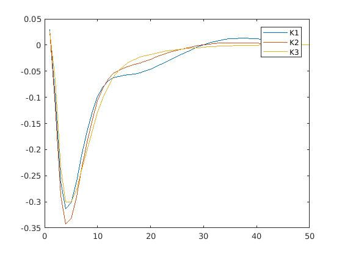
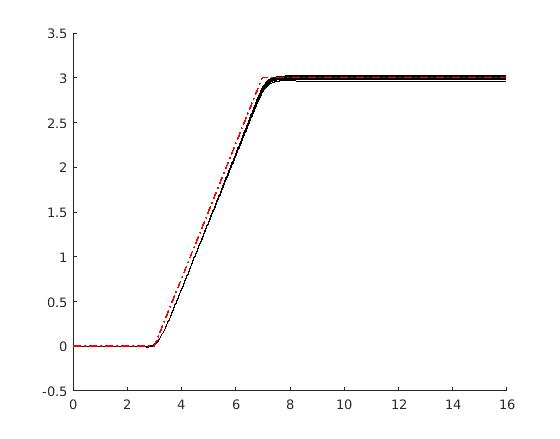
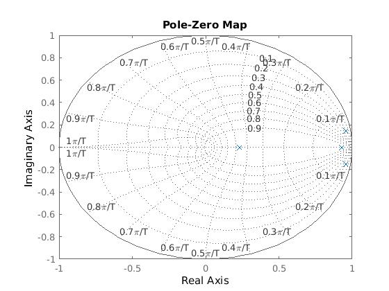
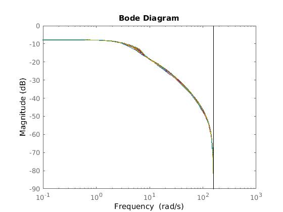

In this repository, we share an implementation of preview control. 

For the details of the implementation and citation please refer to :
- [Self-scheduling robust preview controllers for path tracking and autonomous vehicles](http://www.academia.edu/download/54870827/assc2017.pdf)

@inproceedings{boyali2017self,
  title={Self-scheduling robust preview controllers for path tracking and autonomous vehicles},
  author={Boyali, Ali and John, Vijay and Lyu, Zheming and Swarn, Rathour and Mita, Seichi},
  booktitle={2017 11th Asian Control Conference (ASCC)},
  pages={1829--1834},
  year={2017},
  organization={IEEE}
}

The repository consists of four matlab script files. 
- a file loads generic parameters for simulating the control
- a file that implements uncertain system for the LMI computations
- a post-visualizing simulation file that simulates the control performance

For computations first run `a01_hinfwPoles_LMI_solution.m`. For plotting the results.  run
  `a02_simulate_forrange_of_Vx.m`. 

In the LMI solution script, we set number of preview points and the longitudinal speed range using:

np =50;                             % Number of Preview Points  
VxBound=[5, 30];                     % Polytope Lower and Upper Bounds 

and compute the preview coefficients (feedforward) together with the feedback for the vehicle states. A set of
 figures are produced by the second script file. 
 
 #### Computed Gains for the number of points np=50
 
 
 #### Tracking Performance
   
   
 #### Pole Zero Map for the Discrete System
      
   
 #### and BODE diagrams of the plants
   
 
 
 
 
 
 